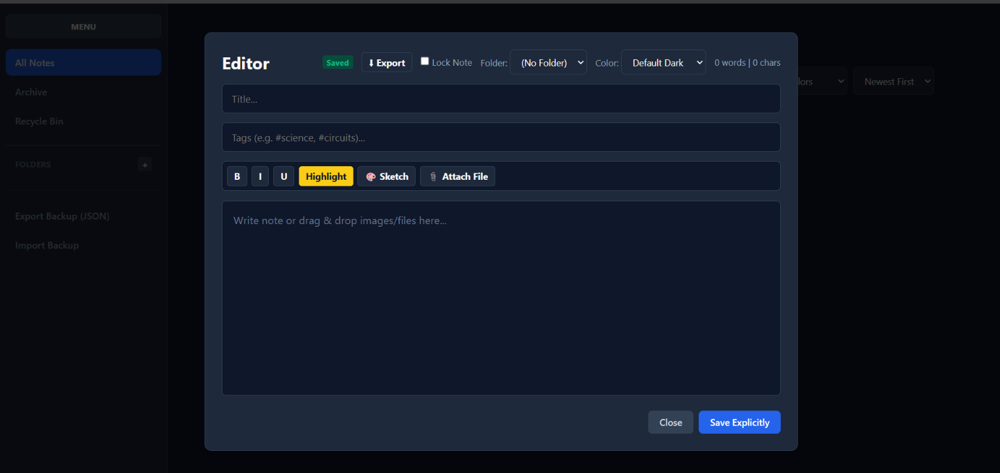

# Anims-Notes

* i am made a note taking website filled with all kind of features. and i have also made it easy to understand and very basic

# Screenshot 

# Demo link 

https://15freaker.github.io/Anims-notes/

# programming language 

* i used HTML, CSS and Java script for this project 

# features

* you can store your notes clean and in tidy way
* you can search your notes
* you can archive notes
* you can delete notes 
* you can export/import notes in json 
* you can create standard notes
* you can create Checklist/to-do list
* you can check/uncheck to-do list
* you can use different color notes
* you can see words and character count
* you can highlight word/sentence
* you can underline word/sentence
* you can write bold word/sentence
* you can write Italic word/sentence
* locked note you have to write its name to delete it
* you can tag your notes
* you can store notes in tidy form by creating folder and file inside of website
* you can attach files 
* you can take notes by sketch 

# how to use it locally 

* clone the repo from github
* double click "index.html" file
* it will open in your browser totally locally.